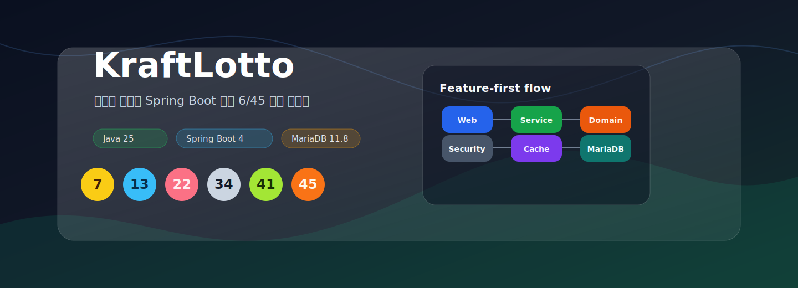

<div align="center">



# KraftLotto

**편향을 피하는 로또 6/45 추천 서비스**

당첨 확률을 높인다고 말하지 않습니다.  
생일 번호 편중, 완전 등차수열, 긴 연속번호, 한 십의자리 쏠림, 과거 1등 조합과의 중복을 차분하게 걸러내는 Spring Boot 애플리케이션입니다.


</div>

> [!IMPORTANT]
> KraftLotto는 예측기가 아니라 편향 회피 도구입니다. 로또의 확률 구조를 바꾸지 않으며, 추천 결과는 학습과 실험 목적의 조합입니다.

## Highlights

- Feature-first 패키징: `recommend`와 `winningnumber`를 독립된 수직 기능으로 분리
- SOLID 친화 설계: 도메인은 Spring/JPA/Web에 의존하지 않고, 외부 API는 `LottoApiClient` 포트로 격리
- 데이터 무결성 3중 방어: 도메인 불변식, JPA 검증, Flyway CHECK 제약
- 운영 가능한 로컬 환경: Docker Compose로 Spring 앱과 MariaDB를 함께 기동
- 테스트 컨벤션: 메소드명은 영어 camelCase, `@DisplayName`은 한글 명세

## Architecture

```text
com.kraft.lotto
├─ feature
│  ├─ recommend
│  │  ├─ domain          ExclusionRule, PastWinningCache
│  │  ├─ application     RecommendService, LottoRecommender
│  │  └─ web             RecommendController, DTO
│  └─ winningnumber
│     ├─ domain          LottoCombination, WinningNumber
│     ├─ application     Collect/Query Service, LottoApiClient
│     ├─ infrastructure  JPA Entity, Repository, Mapper
│     ├─ event           WinningNumbersCollectedEvent
│     └─ web             Public/Admin controllers, DTO
├─ infra                 config, security
└─ support               ApiResponse, ErrorCode, exception handling
```

ArchUnit가 지키는 핵심 규칙:

```text
web -> application -> domain
application -> infrastructure

domain -X-> Spring / JPA / Web
web    -X-> feature.*.infrastructure
```

## Recommendation Rules

| 순서 | 규칙 | 제외 조건 |
|---:|---|---|
| 1 | `BirthdayBiasRule` | 6개 번호가 모두 31 이하 |
| 2 | `ArithmeticSequenceRule` | 6개 번호가 완전 등차수열 |
| 3 | `LongRunRule` | 5개 이상 연속번호 포함 |
| 4 | `SingleDecadeRule` | 한 십의자리 버킷에 5개 이상 집중 |
| 5 | `PastWinningRule` | 과거 1등 조합과 완전히 동일 |

규칙은 가벼운 패턴 검사부터 과거 당첨 캐시 검사 순으로 적용됩니다. 수집 작업이 성공하면 `WinningNumbersCollectedEvent`가 발행되고, `PastWinningCache`가 다시 적재됩니다.

## Quick Start

```powershell
Copy-Item .env.example .env
docker compose up -d --build
```

| 대상 | 주소 |
|---|---|
| Web UI | http://localhost:8080 |
| Health | http://localhost:8080/actuator/health |
| REST Docs | http://localhost:8080/docs/index.html |
| MariaDB | `localhost:3306` |

로컬에서 직접 실행할 때:

```powershell
$env:SPRING_PROFILES_ACTIVE = "local"
.\gradlew.bat bootRun
```

## API

공통 응답 envelope:

```json
{
  "success": true,
  "data": {},
  "error": null
}
```

추천:

```bash
curl -X POST http://localhost:8080/api/recommend \
  -H "Content-Type: application/json" \
  -d '{"count":5}'

curl http://localhost:8080/api/recommend/rules
```

당첨번호:

```bash
curl http://localhost:8080/api/winning-numbers/latest
curl http://localhost:8080/api/winning-numbers/1100
curl "http://localhost:8080/api/winning-numbers?page=0&size=20"
curl http://localhost:8080/api/winning-numbers/stats/frequency
```

관리자 수집:

```bash
curl -u "$KRAFT_ADMIN_USERNAME:$KRAFT_ADMIN_PASSWORD" \
  -X POST http://localhost:8080/api/admin/winning-numbers/refresh \
  -H "Content-Type: application/json" \
  -d '{"targetRound":1103}'
```

## Configuration

| 변수 | 설명 |
|---|---|
| `SPRING_PROFILES_ACTIVE` | `local`, `prod`, `test`, `it` |
| `KRAFT_DB_URL` | MariaDB JDBC URL |
| `KRAFT_DB_USER` / `KRAFT_DB_PASSWORD` | DB 인증 |
| `KRAFT_ADMIN_USERNAME` / `KRAFT_ADMIN_PASSWORD` | 관리자 Basic Auth |
| `KRAFT_API_CLIENT` | `mock`, `dhlottery`, `real` |
| `KRAFT_API_URL` | 동행복권 API base URL |
| `KRAFT_RECOMMEND_MAX_ATTEMPTS` | 추천 생성 최대 시도 횟수 |
| `KRAFT_RECOMMEND_RATE_LIMIT_MAX_REQUESTS` | IP별 추천 요청 허용 횟수 |
| `KRAFT_RECOMMEND_RATE_LIMIT_WINDOW_SECONDS` | 레이트리밋 윈도우 초 |

`.env`는 커밋하지 않습니다. 공유 가능한 기본값은 `.env.example`만 사용합니다.

## Testing

```powershell
.\gradlew.bat test
.\gradlew.bat build
```

| 테스트 | 초점 |
|---|---|
| Domain unit | 값 객체와 제외 규칙 불변식 |
| Application unit | 추천, 수집, 조회 서비스 |
| WebMvc slice | envelope, validation, status mapping |
| Security integration | 공개/관리자 엔드포인트 권한 |
| Testcontainers IT | MariaDB, Flyway, CHECK 제약 |
| ArchUnit | 레이어 의존성 규칙 |

## Operations

- 운영에서는 `KRAFT_API_CLIENT=dhlottery` 또는 `real`을 명시합니다.
- `/api/recommend`는 IP 기반 슬라이딩 윈도우 레이트리밋을 적용합니다.
- `/actuator/health`는 공개, `/actuator/metrics/**`는 관리자 권한이 필요합니다.
- 스키마 변경은 Flyway 마이그레이션으로만 관리합니다.

<div align="center">

**KraftLotto**  
당첨을 약속하지 않고, 편향을 정직하게 피합니다.

</div>
