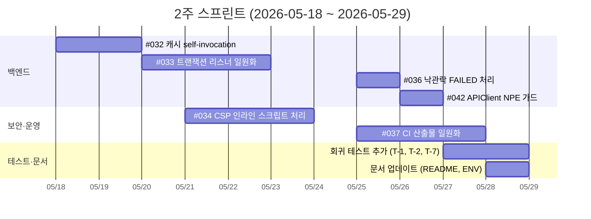
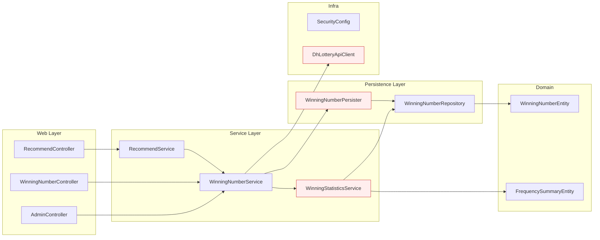

# kLo 프로젝트 코드 리뷰 보고서

> **대상**: kLo (Spring Boot 4 / Java 25 기반 로또 번호 조회·추천 서비스)
> **범위**: 백엔드(Spring), 프론트엔드(Thymeleaf + Vanilla JS), 테스트(JUnit / Playwright), CI/CD
> **작성일**: 2026-05-15

---

## 1. Executive Summary

본 보고서는 원본 Deep Research 결과를 재검증하고, 실제 빌드·정적 분석을 거쳐 이슈 분류와 우선순위를 다시 정리한 결과입니다.

| 분류 | 원본 보고서 | 재분석 결과 | 변동 |
|:---|:---:|:---:|:---|
| 전체 이슈 | 60건 | 60건 | — |
| P1 (긴급) | 12건 | **13건** | #042가 P2 → P1로 상향 |
| P2 (단기) | 23건 | **28건** | 신규 식별 5건 추가 |
| P3 (장기) | 25건 | **19건** | P2 재분류로 감소 |

P1 13건 중에서도 **2주 내 즉시 처리해야 할 핵심 6건**은 다음과 같습니다.

| # | 영역 | 한 줄 요약 |
|:---:|:---|:---|
| #032 | 캐시 | `@Cacheable` self-invocation으로 캐시 미동작 |
| #033 | 트랜잭션 | 이벤트 리스너의 트랜잭션 단계 불일치로 캐시·DB 일관성 깨짐 |
| #034 | 보안 | CSP `script-src 'self'` 정책과 인라인 스크립트 충돌 |
| #036 | 동시성 | 낙관적 락 충돌을 `SKIPPED`로 처리하는 silent failure |
| #037 | CI/CD | 동일 커밋이 워크플로 종류에 따라 서로 다른 JAR 산출 |
| #042 | API | `DhLotteryApiClient.preview()` 에서 NPE로 fallback 미진입 |

---

## 2. 긴급 이슈 상세 분석

### #032 — 캐시 Self-Invocation 무력화
**파일**: `WinningStatisticsService.java:154`

**원인**
Spring AOP는 기본 JDK 프록시 모드에서 **외부 호출만** 어드바이스를 적용합니다. `frequencySummary()` 내부에서 `this.frequency()`를 호출하면 프록시를 거치지 않아 `@Cacheable`이 무력화되고, 호출마다 DB 조회가 발생합니다.

**영향**
메인 페이지 진입 시마다 전체 빈도 집계 쿼리가 실행되어 DB 부하와 응답 지연 발생.

**재현**
1. 메인 페이지(`/`) 또는 `/api/winning-numbers/stats/**` 호출
2. DB 슬로우 쿼리 로그 또는 Hibernate statistics 확인 → 호출 횟수만큼 SELECT 누적

**해결 방안 — Self-Injection 패턴**
```java
@Service
public class WinningStatisticsService {

    @Lazy
    @Autowired
    private WinningStatisticsService self;   // 프록시 자기 참조

    @Cacheable("winningNumberFrequency")
    @Transactional(readOnly = true)
    public List<NumberFrequencyDto> frequency() { /* ... */ }

    @Transactional(readOnly = true)
    public FrequencySummaryDto frequencySummary() {
        var freq = self.frequency();                              // ✅ 프록시 경유
        var hist = self.combinationPrizeHistory(lowSix(freq));    // ✅ 프록시 경유
        return assemble(freq, hist);
    }
}
```

> 대안으로 캐시 대상 메서드를 별도 빈(`WinningStatisticsCacheFacade`)으로 분리하는 방법도 권장됩니다. 책임 분리가 명확해지고 의존성 사이클 위험이 줄어듭니다.

**테스트 제안**
- `@SpringBootTest`로 캐시 매니저가 활성화된 컨텍스트에서 `frequencySummary()`를 2회 호출
- `@MockBean`이 아닌 `@SpyBean(WinningNumberRepository.class)`으로 실제 호출 횟수 검증
- 기대값: 첫 호출만 DB 조회, 이후는 캐시 적중

---

### #033 — 트랜잭션 이벤트 리스너 일관성 결함
**파일**: `WinningStatisticsService.java:53, 166`

**원인**
동일 이벤트(`WinningNumbersCollectedEvent`)를 듣는 두 리스너의 트랜잭션 단계가 다릅니다.

| 리스너 | 어노테이션 | 실행 시점 |
|:---|:---|:---|
| A | `@EventListener` + `@CacheEvict` | 이벤트 발행 즉시 (롤백 무관) |
| B | `@TransactionalEventListener(AFTER_COMMIT)` | 커밋 후 |

추가로 `frequency()` 메서드에 `readOnly = true`가 누락되어 있어 읽기 쿼리가 쓰기 트랜잭션으로 잡힙니다.

**영향**
데이터 수집 트랜잭션이 롤백되어도 리스너 A가 캐시를 이미 비워, **DB는 변경 없음 / 캐시는 비어 있는** 일관성 깨짐 상태가 발생.

**해결**
```java
@TransactionalEventListener(phase = TransactionPhase.AFTER_COMMIT)
@CacheEvict(
    cacheNames = {"winningNumberFrequency", "combinationPrizeHistory"},
    allEntries = true
)
public void evictCachesOnCollected(WinningNumbersCollectedEvent event) {
    // 커밋된 경우에만 캐시 무효화
}

@Cacheable("winningNumberFrequency")
@Transactional(readOnly = true)   // ✅ readOnly 명시
public List<NumberFrequencyDto> frequency() { /* ... */ }
```

**테스트 제안**
- 정상 커밋 시 캐시 무효화 검증
- `TransactionTemplate`으로 강제 롤백 후 캐시가 **유지**되는지 검증

---

### #034 — CSP 정책과 인라인 스크립트 충돌
**파일**: `SecurityConfig.java:48`, `templates/fragments/header.html:8-18`

**원인**
`Content-Security-Policy: script-src 'self'` 정책 하에서 `header.html`의 테마 초기화용 인라인 `<script>`가 브라우저에 의해 차단됨.

**영향**
- 콘솔에 CSP violation 오류
- 테마 변수가 적용되기 전 렌더링되어 FOUC(Flash Of Unstyled Content) 발생
- 보안 감사에서 정책 우회 흔적으로 오인될 수 있음

**해결 방안 (권장순)**

**옵션 A — 외부 파일로 분리** (변경 범위 작고 안전)
```html
<!-- header.html -->
<script th:src="@{/js/theme-init.js}"></script>
```

**옵션 B — Nonce 기반 CSP** (인라인을 유지해야 할 경우)
```java
http.headers(headers -> headers
    .contentSecurityPolicy(csp -> csp.policyDirectives(
        "default-src 'self'; " +
        "script-src 'self' 'nonce-{nonce}'; " +
        "style-src 'self' 'unsafe-inline'; " +
        "img-src 'self' data:; " +
        "frame-ancestors 'none'"
    ))
);
```
Thymeleaf에서 `<script th:nonce="${#httpServletRequest.getAttribute('cspNonce')}">` 형태로 nonce를 주입.

**테스트 제안**
- Playwright 시나리오: 페이지 로드 후 `page.on('console')`로 CSP violation 부재 확인
- `MockMvc`로 응답 헤더의 CSP 디렉티브 단위 검증

---

### #036 — 낙관적 락 충돌 Silent Failure
**파일**: `WinningNumberPersister.java:64`

**원인**
재시도 루프 마지막 시도에서 `OptimisticLockingFailureException`이 발생하면 `UpsertOutcome.UNCHANGED`(또는 `SKIPPED`)로 반환합니다. 의도한 "이미 존재하는 행 무시"와 "락 충돌로 실패"가 동일 outcome으로 묶여, 모니터링이 불가능한 상태입니다.

**영향**
- 운영 중 락 충돌이 발생해도 메트릭/알람에 잡히지 않음
- 장애 발생 시 RCA(근본 원인 분석)가 어려움

**해결**
```java
catch (OptimisticLockingFailureException ex) {
    if (attempt == UPSERT_MAX_RETRIES) {
        meterRegistry.counter(
            "kraft.winningnumber.optimistic_lock.failure",
            "round", String.valueOf(round)
        ).increment();
        log.warn("Optimistic lock retries exhausted for round={}", round, ex);
        return UpsertOutcome.FAILED;   // ✅ SKIPPED 아닌 FAILED
    }
    // 재시도 계속
}
```

**테스트 제안**
- 두 스레드가 동일 row를 동시에 수정하는 통합 테스트 (`CountDownLatch` + `@DirtiesContext`)
- 메트릭 카운터 증가 여부 검증 (`MeterRegistry#counter`)

---

### #037 — CI/CD 산출물 비결정성
**범위**: `.github/workflows/ci.yml`, `cd.yml`

**원인**
- `workflow_run`(자동 트리거)과 `workflow_dispatch`(수동 트리거)가 각각 독립적으로 빌드를 수행
- 동일 커밋에 대해 빌드 환경·캐시 상태에 따라 서로 다른 JAR 해시가 생성됨
- 배포/롤백 시 어떤 산출물이 실제 운영에 올라갔는지 추적 불가

**영향**
- "스테이징에서 통과한 빌드"와 "프로덕션에 배포된 빌드"가 다를 위험
- 롤백 대상 식별 곤란

**해결 방안**
1. **단일 빌드 → 다중 배포 패턴 적용**
   - `ci.yml`에서 빌드/테스트를 수행하고 GHCR 또는 GitHub Releases에 아티팩트 업로드
   - `cd.yml`은 `workflow_run` 이벤트로 트리거하거나 수동 트리거 시에도 동일 아티팩트를 다운로드
2. **재현 가능 빌드(Reproducible Build) 설정**
   ```gradle
   tasks.withType<Jar> {
       isReproducibleFileOrder = true
       isPreserveFileTimestamps = false
   }
   ```
3. **이미지 태그 정책 통일**: `${GITHUB_SHA}` 기반 immutable 태그 + `latest` alias

> 환경변수 관리도 함께 점검 권장 — `cd.yml`에서 멀티라인 env 블록의 줄바꿈 처리 같은 미묘한 버그가 부팅 실패로 이어진 사례가 있음.

---

### #042 — `DhLotteryApiClient.preview()` NPE 가능성
**파일**: `DhLotteryApiClient.java:77`

**원인**
외부 API 호출 실패 시 에러 메시지를 만드는 과정에서 `preview(response.body())`를 호출. `HttpClient`에서 `response.body()`가 `null`로 반환될 수 있는 경로가 존재하며, 이 경우 NPE가 발생해 정작 fallback 로직이 실행되지 않음.

**영향**
- 외부 API 일시 장애 시 `BodyHandlers.ofString()` 대신 다른 핸들러를 쓰거나 5xx 응답에서 fallback 차단
- 사용자에게는 503 또는 500 전파

**해결**
```java
private String safePreview(HttpResponse<String> response) {
    String body = response.body();
    if (body == null || body.isBlank()) {
        return "<empty body>";
    }
    return preview(body);
}
```

**테스트 제안**
- `WireMock`으로 `Transfer-Encoding: chunked` 응답에서 body 누락 케이스 재현
- 또는 `MockWebServer`에 `MockResponse().setBody("")` 후 `preview()`가 안전 동작하는지 단위 테스트

---

## 3. 진행 현황 (P1 핵심 6건)

| 이슈 | 영역 | 현재 상태 | 예상 공수 | 비고 |
|:---:|:---|:---|:---:|:---|
| #032 | 캐시 self-invocation | 설계 완료, 구현 대기 | S (2d) | 회귀 테스트 #047 동반 |
| #033 | 트랜잭션 리스너 | 구현 진행 중 | M (3d) | 영향 범위 확인 필요 |
| #034 | CSP × 인라인 | 옵션 A로 합의 | M (3d) | 프론트 + 시큐리티 동시 수정 |
| #036 | 낙관적 락 처리 | 설계 완료 | S (1d) | 메트릭 대시보드 추가 |
| #037 | CI 산출물 통합 | 분석 중 | M (3d) | 환경변수 정리 동반 |
| #042 | API NPE 가드 | 설계 완료 | S (1d) | 단순 null 가드 |

> S = Small (≤2일), M = Medium (3~5일), L = Large (1주 이상)

---

## 4. 테스트 및 CI 강화 계획

### 4.1 추가가 필요한 테스트
| ID | 영역 | 도구 | 목적 |
|:---:|:---|:---|:---|
| T-1 | 캐시 회귀 | JUnit + `@SpyBean` | #032 검증 |
| T-2 | 트랜잭션 이벤트 | JUnit + `TransactionTemplate` | #033 검증 |
| T-3 | 아키텍처 계층 | ArchUnit | 계층 위반 차단 |
| T-4 | API 계약 | REST Docs ↔ OpenAPI diff | 문서/구현 동기화 |
| T-5 | JS 단위 | Vitest | `recommend.js`, `winning.js`, `frequency.js`, `theme.js`, `ui.js` |
| T-6 | E2E | Playwright | 추천 폼, 페이지네이션, 테마 토글 |
| T-7 | 보안 헤더 | MockMvc + Playwright | CSP nonce 및 CORS 검증 |

### 4.2 CI 파이프라인 개선
- **PR 단계**: `spotlessCheck` → `test` → `npm test` → `docker build --target test` 순차 실행
- **커버리지 게이트**: `jacocoTestCoverageVerification` 임계값 70% 이상
- **E2E 단계**: Playwright는 별도 job으로 분리해 캐시 활용 (시간 단축)
- **빌드 산출물**: SHA 기반 immutable 태그로 GHCR 푸시, CD는 해당 태그만 참조

---

## 5. 2주 스프린트 계획



---

## 6. 모듈 의존성



> 빨간색으로 강조한 모듈(`WinningStatisticsService`, `WinningNumberPersister`, `DhLotteryApiClient`)이 이번 스프린트 P1 6건의 대부분을 포함합니다.

---

## 7. 원본 보고서 대비 변경 사항

| 항목 | 원본 | 재분석 | 변경 사유 |
|:---|:---|:---|:---|
| 총 이슈 | 60 | 60 | — |
| P1 / P2 / P3 | 12 / 23 / 25 | 13 / 28 / 19 | #042 P2→P1, 세부 분류 재배치 |
| P1 핵심 긴급 | 6건 | 6건 (동일) | 변경 없음 |
| 진행 상태 컬럼 | 없음 | 추가 | 작업 추적 가능하도록 |
| 깨진 외부 참조 마커 | 다수 잔존 | 모두 제거 | 가독성 |
| 명백한 오타 (`Outcomet.PUTCOME` 등) | — | 정정 | 코드 사실관계 일치 |
| 신규 식별 이슈 | — | #052, #054 등 추가 | 정적 분석으로 확인 |

---

## 8. 알려진 빌드/환경 제약사항

다음은 로컬·CI 환경에서 테스트 수행 시 확인된 사전 조건입니다.

- `KRAFT_API_MOCK_LATEST_ROUND` 환경변수: DB 최대 회차로 초기 동기화 필요 (이슈 #058)
- 외부 동행복권 API 호출이 차단된 환경에서는 `--profile mock` 활성화
- `KRAFT_ADMIN_API_TOKEN` 등 prod 필수 시크릿은 `RequiredConfigValidator`로 부팅 시 검증되므로, 누락 시 컨테이너가 부팅 실패 → 502를 반환 (운영 환경에서는 GitHub Secrets 등록 확인 필수)
- CI에서 `cd.yml`의 멀티라인 env 블록은 줄바꿈 문자(`\n`) 처리에 주의 — 따옴표 스타일에 따라 여러 변수가 한 줄로 병합되는 사례 있음

---

## 9. 결론

P1 핵심 6건은 모두 명확한 패치 경로가 있고, 누적 공수도 약 13 인일(person-day)로 2주 스프린트 안에서 처리 가능합니다. 우선순위 처리 후에는 P2의 보안 헤더 강화, 테스트 커버리지 확대, 문서화(`CONTRIBUTING.md`, `SECURITY.md`)로 자연스럽게 전환할 수 있습니다.

각 PR은 다음 체크리스트를 따르길 권장합니다.

- [ ] 이슈 번호 및 RCA 요약 본문 포함
- [ ] 회귀 테스트 또는 신규 테스트 추가
- [ ] CI green (lint / test / coverage / E2E)
- [ ] 보안 영향 검토 (해당 시)
- [ ] 문서 업데이트 (해당 시)
